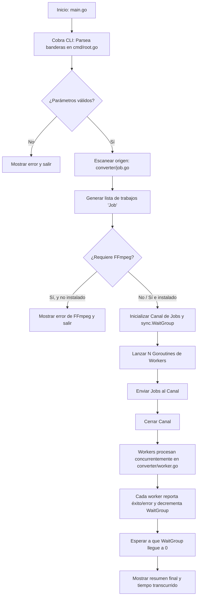

# 🎬 Estructura y Concurrencia de Media Converter CLI

Este documento describe detalladamente la arquitectura, el flujo de datos y los conceptos fundamentales de concurrencia en Go utilizados en la herramienta **Media Converter CLI**. Está estructurado de manera modular y jerárquica para facilitar la generación de diapositivas de presentación.

---

## 1. Introducción al Proyecto

### ¿Qué es Media Converter CLI?
Es una herramienta de línea de comandos (CLI) de alto rendimiento desarrollada en **Go** para la conversión y optimización en lote de archivos multimedia (imágenes y videos).

### Tecnologías Clave:
*   **Lenguaje Go (Golang):** Elegido por su eficiencia, compilación a código nativo y soporte nativo para concurrencia de alto nivel.
*   **Cobra CLI (`github.com/spf13/cobra`):** Biblioteca estándar de la industria en Go para estructurar aplicaciones de línea de comandos, gestionar banderas (flags) y generar ayuda automática.
*   **Imaging (`github.com/disintegration/imaging`):** Paquete de procesamiento de imágenes para realizar operaciones como redimensionado (Lanczos), recorte y superposición de marcas de agua.
*   **WebP (`github.com/deepteams/webp` y `golang.org/x/image/webp`):** Soporte para codificación y decodificación del formato moderno de imágenes WebP.
*   **FFmpeg:** Herramienta externa invocada mediante procesos del sistema para realizar la conversión de video a formato MP4 (H.264 / AAC).

---

## 2. Arquitectura y Estructura del Código

El proyecto sigue una estructura limpia y modular típica de Go:

```text
📂 media-converter/
 ├── 📄 main.go             # Punto de entrada de la aplicación
 ├── 📁 cmd/
 │    └── 📄 root.go        # Configuración de comandos de Cobra y orquestación
 └── 📁 converter/
      ├── 📄 job.go         # Estructuras de datos y descubrimiento de archivos
      ├── 📄 validator.go   # Validación de rutas, permisos y formatos
      ├── 📄 converter.go   # Lógica interna de conversión (imagen y video)
      ├── 📄 worker.go      # Implementación del pool de trabajadores concurrentes
      └── 📄 logger.go      # Funciones auxiliares para imprimir en consola
```

### Detalle de los Módulos:
1.  **`main.go`**: Únicamente inicializa la ejecución llamando a `cmd.Execute()`.
2.  **`cmd/root.go`**: Define las banderas CLI (`--input`, `--output`, `--format`, `--workers`, `--quality`, etc.) y actúa como el **orquestador central** que valida los argumentos, escanea los archivos, inicializa el canal de comunicación, lanza las goroutines y espera la finalización del proceso.
3.  **`converter/job.go`**: Define el objeto `Job` que contiene la ruta de origen y de destino. Implementa `GetJobs`, que puede listar archivos en un único nivel o realizar una búsqueda recursiva por subcarpetas utilizando `filepath.Walk`, replicando la estructura de carpetas de origen en el destino.
4.  **`converter/validator.go`**: Centraliza la validación de formatos soportados, verifica que los directorios existan y realiza una prueba activa de permisos de escritura mediante la creación y eliminación de un archivo temporal (`.write_test`).
5.  **`converter/converter.go`**: Contiene la lógica de transformación de archivos. Identifica si el archivo es video o imagen. Si es video, invoca a FFmpeg. Si es imagen, la decodifica, aplica redimensionado, superpone la marca de agua con opacidad, genera miniaturas si se solicita, y la codifica en el formato final.
6.  **`converter/worker.go`**: Contiene la función que ejecutan las goroutines concurrentes, encargadas de extraer tareas del canal de comunicación y procesarlas una a una.
7.  **`converter/logger.go`**: Controla el formato de salida en consola para mostrar el progreso y el reporte final.

---

## 3. Flujo de Ejecución del Programa



---

## 4. Concurrencia en Go: Goroutines y Channels

El núcleo de la velocidad de este programa reside en su modelo de concurrencia basado en el **patrón de Worker Pool (Pool de Trabajadores)**. A continuación, se detallan los cuatro pilares utilizados.

### A. Goroutines (Gorrutinas)
Una **goroutine** es un hilo de ejecución ligero administrado por el runtime de Go. A diferencia de los hilos tradicionales del sistema operativo (que consumen megabytes de memoria), una goroutine comienza consumiendo solo unos pocos kilobytes, lo que permite ejecutar miles de ellas simultáneamente de forma eficiente.

*   **Implementación en el proyecto (`cmd/root.go`):**
    El programa lanza tantas goroutines como trabajadores se configuren con la palabra clave `go`:
    ```go
    for i := 0; i < effectiveWorkers; i++ {
        waitGroup.Add(1)
        // La palabra clave 'go' inicia el Worker concurrentemente en segundo plano
        go converter.Worker(i+1, jobs, &waitGroup, &completed, &failed, totalJobs, opts)
    }
    ```

### B. Channels (Canales)
Los **canales** son los conductos que permiten a las goroutines comunicarse entre sí y sincronizarse de forma segura sin necesidad de bloqueos manuales complejos (como exclusiones mutuas o mutex). Siguen la filosofía de Go: *"No comuniques compartiendo memoria; comparte memoria comunicando"*.

En este proyecto, se utiliza un canal con buffer como una **cola de tareas sincronizada**:
1.  **Creación del canal:** Se crea un canal capaz de albergar la totalidad de los trabajos para evitar bloqueos al escribir:
    ```go
    jobs := make(chan converter.Job, len(jobsToProcess))
    ```
2.  **Llenado del canal:** El hilo principal añade cada objeto `Job` al canal:
    ```go
    for _, job := range jobsToProcess {
        jobs <- job // Envía el trabajo al canal
    }
    ```
3.  **Cierre del canal:** Una vez que se han enviado todos los trabajos, el canal se cierra. Esto indica a los trabajadores que ya no habrá más tareas:
    ```go
    close(jobs)
    ```
4.  **Consumo concurrente (`converter/worker.go`):**
    Múltiples trabajadores leen concurrentemente del mismo canal utilizando un bucle `for range`. Este bucle extrae elementos automáticamente hasta que el canal se queda vacío y es cerrado:
    ```go
    func Worker(id int, jobs chan Job, waitGroup *sync.WaitGroup, completed *int32, failed *int32, total int, opts Options) {
        fmt.Printf("Worker %d started\n", id)
        // El bucle se bloquea esperando tareas y finaliza cuando el canal se cierra
        for job := range jobs {
            err := convert(job, opts)
            // Procesamiento de resultados...
        }
        waitGroup.Done()
    }
    ```

### C. Sincronización con `sync.WaitGroup`
Cuando se ejecutan tareas en segundo plano mediante goroutines, el hilo principal de Go no espera a que estas terminen; continúa su ejecución y finaliza el programa inmediatamente. Para evitar esto, se utiliza un **`sync.WaitGroup`** (grupo de espera).

*   **`waitGroup.Add(n)`**: Registra cuántas tareas o trabajadores deben completarse antes de continuar (se ejecuta en el hilo principal antes de lanzar las goroutines).
*   **`waitGroup.Done()`**: Indica que un trabajador ha finalizado su labor. Cada worker ejecuta esta función al salir de su bucle de tareas (normalmente asegurado con `defer` o al final de la función del worker).
*   **`waitGroup.Wait()`**: Bloquea el hilo principal del programa en ese punto exacto hasta que el contador interno del WaitGroup llegue a cero (es decir, cuando todos los trabajadores hayan llamado a `Done()`).

*   **Uso en el proyecto:**
    ```go
    // Hilo principal (cmd/root.go)
    var waitGroup sync.WaitGroup

    for i := 0; i < effectiveWorkers; i++ {
        waitGroup.Add(1) // Suma 1 al contador por cada worker a lanzar
        go converter.Worker(...)
    }

    // ... llenar y cerrar canal ...

    waitGroup.Wait() // Bloquea hasta que todos los workers invoquen Done()
    // A partir de aquí, es seguro asumir que todo ha terminado
    ```

    ```go
    // Hilo del trabajador (converter/worker.go)
    func Worker(..., waitGroup *sync.WaitGroup, ...) {
        // ... procesar tareas del canal ...
        waitGroup.Done() // Resta 1 al contador del WaitGroup al finalizar la función
    }
    ```

### D. Operaciones Atómicas con `sync/atomic`
Cuando múltiples goroutines intentan leer y escribir sobre una misma variable en memoria simultáneamente (por ejemplo, contadores globales de éxito o error), se genera una condición de carrera (race condition), lo que puede corromper el valor de la variable.

Para evitar el uso de semáforos (mutex) que ralentizan el procesamiento, el programa utiliza operaciones de nivel de hardware provistas por el paquete **`sync/atomic`**.

*   **Uso en el proyecto (`converter/worker.go`):**
    ```go
    // Incrementa de forma segura y atómica el contador de completados en 1
    current := atomic.AddInt32(completed, 1)

    if err != nil {
        // Incrementa de forma segura el contador de fallidos en 1
        atomic.AddInt32(failed, 1)
    }
    ```

---

## 5. El Modelo de Worker Pool (Explicación Visual para Diapositivas)

Este patrón distribuye la carga de trabajo de manera equitativa sin sobrecargar los recursos de la máquina.

```text
                           ┌──────────────┐
                           │  GetJobs()   │
                           └──────┬───────┘
                                  │ genera N Jobs
                                  ▼
                     ┌──────────────────────────┐
                     │ Canal de Jobs (Buffer)   │
                     │ [Job 1] [Job 2] [Job 3]  │
                     └──────┬──────┬──────┬─────┘
                            │      │      │
           ┌────────────────┘      │      └────────────────┐
           │ extrae tareas         │ extrae tareas         │ extrae tareas
           ▼                       ▼                       ▼
    ┌─────────────┐         ┌─────────────┐         ┌─────────────┐
    │  Worker 1   │         │  Worker 2   │         │  Worker N   │
    │ (Goroutine) │         │ (Goroutine) │         │ (Goroutine) │
    └──────┬──────┘         └──────┬──────┘         └──────┬──────┘
           │                       │                       │
           ▼                       ▼                       ▼
   Ejecuta convert()       Ejecuta convert()       Ejecuta convert()
           │                       │                       │
           └───────────────────────┼───────────────────────┘
                                   ▼
                       ┌──────────────────────┐
                       │  sync.WaitGroup      │
                       │ (Coordina el fin)    │
                       └──────────────────────┘
```

### Ventajas del Worker Pool:
1.  **Control de Recursos:** Evita que el sistema operativo intente abrir miles de archivos o procesos simultáneamente, lo cual agotaría la memoria RAM o los descriptores de archivos. El límite de concurrencia está acotado estrictamente por el número de trabajadores (`-w` o núcleos de CPU).
2.  **Balanceo Dinámico de Carga:** Si una tarea es pesada (por ejemplo, un video de 1 GB) y otra es ligera (una imagen de 10 KB), el worker que termine primero tomará inmediatamente el siguiente trabajo libre, maximizando la eficiencia de la CPU.

---

## 6. Procesamiento Técnico de Medios

### Procesamiento de Imágenes:
La función `convert` en `converter/converter.go` realiza un pipeline de transformaciones sobre cada imagen:
1.  **Decodificación:** Soporta formatos estándar y WebP (usando decodificadores específicos de Go).
2.  **Redimensionado Proporcional:**
    *   Si se especifican ancho y alto, se recortan los bordes excedentes y se centra la imagen (`imaging.Fill`).
    *   Si se especifica solo una dimensión, se escala manteniendo la relación de aspecto (`imaging.Resize`).
    *   Utiliza el filtro **Lanczos**, un algoritmo de alta calidad para remuestreo espacial.
3.  **Marca de Agua (Watermark):**
    *   Abre la imagen del logotipo.
    *   Calcula el tamaño del logo dinámicamente para que represente el 10% del ancho de la imagen destino.
    *   Lo posiciona en la esquina inferior derecha con un margen de 10 píxeles.
    *   Lo superpone con una opacidad del 50% (`0.5`).
4.  **Generación de Miniaturas (Thumbnail):**
    *   Si la bandera está activa, crea adicionalmente una miniatura de 150x150 píxeles a partir de la imagen procesada y la guarda con el sufijo `_thumb`.
5.  **Codificación y Guardado:** Escribe el archivo final aplicando niveles de calidad si el formato de destino es JPEG o WebP.

### Procesamiento de Videos:
1.  **Validación de Herramientas:** Si el lote contiene videos y el formato de salida es `.mp4`, el programa verifica en el PATH que el comando `ffmpeg` esté disponible antes de iniciar.
2.  **Llamada al Sistema:** Invoca a la herramienta FFmpeg de forma nativa mediante `exec.Command` pasando los siguientes parámetros de optimización:
    *   `-c:v libx264`: Codifica el video usando el códec ampliamente compatible H.264.
    *   `-c:a aac`: Codifica el audio usando el códec estándar AAC.
    *   `-y`: Sobrescribe los archivos de destino existentes de manera automática.
